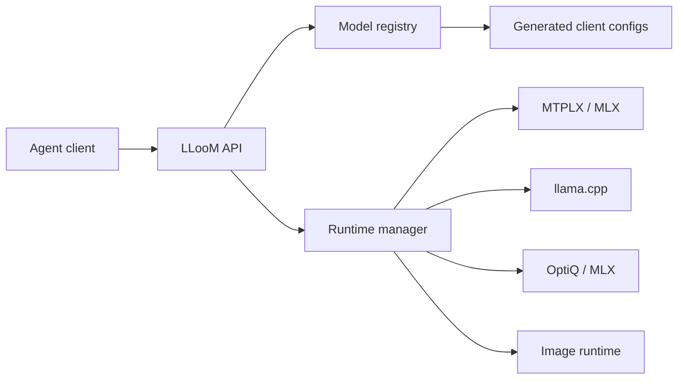

# LLooM

LLooM is a local-first LLM gateway for people who run serious open models on their own hardware. It sits in front of MLX, MTPLX, llama.cpp, Ollama, image generators, and other local runtimes, then exposes stable OpenAI-compatible and Anthropic-compatible APIs to agent tools.

The goal is simple: install one bridge, let it pick and keep warm the best model recipe for the machine, and point Codex, Claude Code, OMP, OpenCode, Hermes, Zero, or any OpenAI-compatible client at one base URL.

## Current Shape

- OpenAI-compatible model catalog at `GET /v1/models`
- OpenAI-compatible chat proxy at `POST /v1/chat/completions`
- OpenAI-compatible Responses bridge at `POST /v1/responses`, including function-call output items and streaming argument deltas
- OpenAI-compatible embeddings proxy at `POST /v1/embeddings`
- OpenAI-compatible image generation proxy at `POST /v1/images/generations`
- OpenAI-compatible speech generation proxy at `POST /v1/audio/speech`
- OpenAI-compatible audio transcription proxy at `POST /v1/audio/transcriptions`
- Anthropic Messages bridge at `POST /v1/messages`, including tool-use and streaming deltas
- Runtime manager for local process start, health checks, stop, warmup, keep-warm bootstrapping, and per-runtime concurrency slots
- In-memory per-model and per-route metrics at `GET /gateway/metrics`
- Backend catalog for MTPLX, MLX LM, llama.cpp, Ollama, OptiQ, stable-diffusion.cpp, and vLLM
- Community benchmark evidence files that rank model/backend recipes for a machine class
- Generated OMP and OpenCode config from the same model registry the gateway advertises
- Recipe files for machine/model/backend choices, starting with the Apple Silicon Qwen3.6 MTPLX/OptiQ lane

## Quick Start

```zsh
git clone <repo-url> lloom
cd lloom
npm run check
LLOOM_CONFIG=config/default.json npm start
```

Default local endpoint:

```zsh
curl -sS http://127.0.0.1:8100/health
curl -sS http://127.0.0.1:8100/v1/models
curl -sS http://127.0.0.1:8100/gateway/status
curl -sS http://127.0.0.1:8100/gateway/metrics
curl -sS 'http://127.0.0.1:8100/gateway/setup/status?runtimes=false'
```

First-run setup:

```zsh
node bin/lloom.mjs setup
node bin/lloom.mjs setup-status --no-runtimes
node bin/lloom.mjs setup --config-out ~/.lloom/config.json --model-root ~/.lloom/models --client omp --apply --yes
LLOOM_CONFIG=~/.lloom/config.json npm start
```

`setup` profiles the machine, selects the best recipe, writes a user config, plans backend installation, plans model download/tuning, and installs selected client integration files. It is a dry-run by default; real execution requires `--apply --yes`. Add `--start` when you want setup to start the configured keep-warm runtimes after applying.

`setup-status` reads the same recipe plan plus `data/install-state.json`, model directories, generated/native client files, and optional runtime health. Use `--no-runtimes` when you want a fast filesystem-only readiness report.

Lower-level setup commands remain available when you want to inspect or run a phase separately:

```zsh
node bin/lloom.mjs init
node bin/lloom.mjs init --config-out ~/.lloom/config.json --model-root ~/.lloom/models --client omp --apply --yes
node bin/lloom.mjs bootstrap
node bin/lloom.mjs bootstrap --apply --yes
```

`init` only writes local config and generated profiles. `bootstrap` plans and applies backend setup, model download/tuning, and client integration writes for an existing config.

Generate client configs:

```zsh
npm run generate:clients
node bin/lloom.mjs integrations
node bin/lloom.mjs integrate all
```

Outputs:

- `clients/generated/omp-models.yml`
- `clients/generated/omp-config.yml`
- `clients/generated/opencode.json`
- `clients/generated/codex.env`
- `clients/generated/lloom-codex`
- `clients/generated/claude.env`
- `clients/generated/lloom-claude`
- `clients/generated/hermes.env`
- `clients/generated/lloom-hermes`
- `clients/generated/zero.env`
- `clients/generated/lloom-zero`
- `clients/generated/lloom-integrations.json`

Committed examples live in `clients/examples/`; generated files are ignored so local machine-specific config changes do not become source churn.

The generator reads the gateway registry. If a model ID is stale, remove it from the registry. LLooM does not hide stale IDs with fallback compatibility aliases.

`integrate` is a dry-run by default. Real client file writes require both `--apply` and `--yes`:

```zsh
node bin/lloom.mjs integrate omp --apply --yes
```

OMP has native targets at `~/.omp/agent/models.yml` and `~/.omp/agent/config.yml`. The model catalog contains exact advertised IDs only, and the role config pins OMP to the fastest 27B default. OpenCode, Codex, Claude-compatible, Hermes, and Zero profiles are written as managed LLooM artifacts under `~/.lloom/integrations/` until their stable native config contracts are pinned.

Codex, Claude-compatible, Hermes, and Zero integrations also install launchers under `~/.lloom/bin/` so you can run `lloom-codex`, `lloom-claude`, `lloom-hermes`, or `lloom-zero` with the managed environment loaded. Add that directory to `PATH` after integration.

Inspect install recipes:

```zsh
node bin/lloom.mjs profile
node bin/lloom.mjs backends
node bin/lloom.mjs backend-plan mtplx
node bin/lloom.mjs backend-install mtplx
node bin/lloom.mjs select
node bin/lloom.mjs recipes
node bin/lloom.mjs recipe-index
node bin/lloom.mjs recipe-import ./my-recipe-pack.json
node bin/lloom.mjs benchmarks
node bin/lloom.mjs benchmarks apple-silicon-qwen36
node bin/lloom.mjs plan apple-silicon-qwen36 --model-root ~/Models
node bin/lloom.mjs install apple-silicon-qwen36 --model-root ~/Models
node bin/lloom.mjs setup-status --recipe apple-silicon-qwen36 --model-root ~/Models --no-runtimes
```

Recipe selection distinguishes `selectable` from `runnable`: a recipe can be the best match for the machine even if setup still needs to install or expose a backend command. Plans are intentionally explicit: LLooM reports checks, downloads, tuning commands, model mappings, and platform requirements before executing anything. `install` is a dry-run by default. Real execution requires both `--apply` and `--yes`:

```zsh
node bin/lloom.mjs install apple-silicon-qwen36 --model-root ~/Models --apply --yes
```

Completed real install steps are recorded in `data/install-state.json`, so interrupted setup can resume without rerunning completed steps. Hugging Face model downloads use `hf download` or `huggingface-cli download`; set `LLOOM_HF_BIN=/path/to/hf` when the CLI lives outside `PATH`. If a model destination already has files, LLooM treats that download step as satisfied.

`setup-status` reports whether backend steps, recipe steps, model folders, selected client integration files, and keep-warm runtimes are current. It distinguishes valid configuration from complete installation so automation can decide whether to run setup, install missing models, rewrite client files, or start keep-warm.

Runtime management:

```zsh
node bin/lloom.mjs runtimes
node bin/lloom.mjs runtime-start mtplx-qwen36-27b-speed
node bin/lloom.mjs runtime-warmup mtplx-qwen36-27b-speed
node bin/lloom.mjs runtime-stop mtplx-qwen36-27b-speed
node bin/lloom.mjs keep-warm
```

The same controls are exposed over HTTP for dashboards and external automation:

```zsh
curl -sS http://127.0.0.1:8100/gateway/status
curl -sS http://127.0.0.1:8100/gateway/metrics
curl -sS 'http://127.0.0.1:8100/gateway/metrics?model=Youssofal%2FQwen3.6-27B-MTPLX-Optimized-Speed'
curl -sS 'http://127.0.0.1:8100/gateway/setup/status?runtimes=false'
curl -sS -X POST http://127.0.0.1:8100/gateway/runtimes/mtplx-qwen36-27b-speed/start
curl -sS -X POST http://127.0.0.1:8100/gateway/runtimes/mtplx-qwen36-27b-speed/warmup
curl -sS -X POST http://127.0.0.1:8100/gateway/runtimes/mtplx-qwen36-27b-speed/stop
```

Requests through chat/image/message APIs call the runtime manager automatically. Manual `start` is allowed for configured runtimes even when `enabled` is false; automatic model-request startup and keep-warm bootstrapping require `enabled: true`.

Runtime definitions can set `maxConcurrency`. Model requests acquire a runtime slot before contacting the upstream backend, so optimized text lanes can run multiple concurrent agent streams while image and audio runtimes can stay serial. `/gateway/status` reports `maxConcurrency`, `activeRequests`, and `queuedRequests` for each runtime.

Backend plans are read-only readiness reports. They show supported platforms, expected commands, server protocol paths, and setup steps for each runtime family. Recipes reference backend IDs from the catalog so community recipes can share a common backend vocabulary.

Backend installs are dry-runs by default. Real execution requires `--apply --yes` and writes resumable state to `data/install-state.json`. Link steps can create local command shims in `data/bin`, so a backend installed beside LLooM can be exposed without a global install:

```zsh
node bin/lloom.mjs backend-install mtplx --apply --yes
export PATH="$PWD/data/bin:$PATH"
```

Benchmark evidence lives in `benchmarks/community/*.json`. `lloom benchmarks` validates and ranks all local evidence, while recipe plans attach the best matching result to each model role. `lloom recipe-index` validates `recipes/index.json`, joins indexed recipes to their benchmark evidence, and prints the plan/install/bootstrap commands that a user or CI job can trust.

Community recipe packs can be previewed and imported without hand-editing the local index:

```zsh
node bin/lloom.mjs recipe-import ./qwen-next-pack.json
node bin/lloom.mjs recipe-import ./qwen-next-pack.json --trusted-key publisher=./publisher.pub --require-signature
node bin/lloom.mjs recipe-import ./qwen-next-pack.json --apply --yes
```

Recipe import writes the recipe JSON, merges the index entry, and stores attached benchmark suites. It accepts local files today and HTTP(S) pack URLs for hosted recipe feeds. Signed packs can be verified with Ed25519 public keys before import.

## Model IDs

The registry is the source of truth. `/v1/models`, OMP YAML, and OpenCode JSON are all derived from `models[]` in `config/default.json`.

Current Apple Silicon headline defaults:

- Fastest dense 27B: `Youssofal/Qwen3.6-27B-MTPLX-Optimized-Speed`
- Fastest 35B-A3B MoE observed here: `Youssofal/Qwen3.6-35B-A3B-MTPLX-Optimized-Speed-FP16`

Durable route aliases such as `qwen36-27b-fastest` are allowed for scripts and humans, but `/v1/models` and generated client profiles advertise exact model IDs only.

## Architecture



## Roadmap

- Recipe apply rollback and richer progress UI
- Reasoning-block parity across OpenAI Responses and Anthropic Messages streams
- Responses API parity for reasoning blocks and multimodal output items
- Richer backend installers for MTPLX, MLX, llama.cpp, Ollama, and image/audio runtimes
- Machine profiler and automatic recipe selection
- Signed benchmark submissions and hosted recipe feeds
- Per-model memory admission and eviction policy
- Vision and richer multimodal output parity across supported backends
