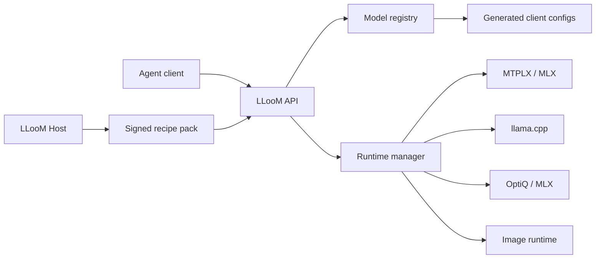

# LLooM

[](https://github.com/enntity/lloom/actions/workflows/ci.yml)
[](LICENSE)

LLooM is a local-first LLM gateway for people who run serious open models on their own hardware. It treats NVIDIA systems—including DGX Spark / GB10—and Apple Silicon Macs as first-class platforms. LLooM sits in front of vLLM, SGLang, MLX, MTPLX, llama.cpp, Ollama, image generators, and other local runtimes, then exposes stable OpenAI-compatible and Anthropic-compatible APIs to agent tools.

The goal is simple: install one bridge, let it inspect the machine, choose the best agentic model recipe from the LLooM community library, install the backend needed for that recipe, download and configure the model, keep it warm, and point Codex, Claude Code, OMP, OpenCode, Hermes, Zero, or any OpenAI-compatible client at one base URL.

The hosted LLooM service is a separate product surface. It owns the recipe database, benchmark leaderboard, community submissions, signing keys, and moderation. The local gateway only imports signed recipe packs from that host and runs local backends; it does not do hosted community state, accounts, global rankings, or remote memory management.

> **Project status:** LLooM is pre-1.0 and under active development. The GitHub repository is currently the canonical distribution; the `lloom` npm package has not been published yet.

The planned public community host is `https://lloom.enntity.com`; source checkouts use the bundled loopback development host. The `community.example` URLs elsewhere in this README remain generic examples for self-hosted operators.

## First-Class Platforms

| NVIDIA / DGX Spark                                                                     | Apple Silicon                                                                     |
| -------------------------------------------------------------------------------------- | --------------------------------------------------------------------------------- |
| CUDA, Blackwell, DGX Spark / GB10, and Linux NVIDIA hosts                              | M-series Macs with unified memory                                                 |
| vLLM and SGLang are the primary high-throughput backends                               | MLX, MTPLX, OptiQ, and llama.cpp are the primary native backends                  |
| Managed Docker runtimes, GPU-memory admission, warm/on-demand lanes, and Spark recipes | Native processes, unified-memory-aware recipes, model-root reuse, and Mac recipes |
| See [`docs/dgx-spark.md`](docs/dgx-spark.md)                                           | See the bundled `apple-silicon-*` recipes                                         |

Both platforms get the same gateway APIs, runtime policy, per-connection telemetry, live dashboard, client integrations, external-provider passthrough, and community recipe/benchmark workflow.

The bundled offline recipe library stays deliberately small: proven Apple Silicon Qwen3.6 lanes, Unsloth Qwen3.6 35B-A3B and 27B NVFP4 for DGX Spark/GB10, and conventional FLUX.2 Klein 4B plus Qwen-Image-2512 image lanes for high-memory systems. The community host automatically includes every bundled recipe and adds the wider experimental and opt-in catalog; host entries can override a bundled recipe with stronger evidence without making offline setup depend on the host.

## Quick Start

```bash
git clone https://github.com/enntity/lloom.git
cd lloom
npm ci
npm link
lloom
lloom up --go
```

`npm link` installs the same `lloom` and `lloom-host` commands from your checkout. After the first npm release, `npm install -g lloom` will be the supported package install path.

Open the dashboard in any browser or point an OpenAI-compatible client at the local endpoint:

```bash
curl -sS http://127.0.0.1:8100/health
curl -sS http://127.0.0.1:8100/v1/models
```

Dashboard: [http://127.0.0.1:8100/](http://127.0.0.1:8100/)

That is the 1.0 path. A bare `lloom` is a dry run first: it inspects the machine, asks the LLooM community host for the best known recipe pack and backend catalog, shows what will be installed, and refuses writes until you rerun it with `--go`. `up` is the named alias for the same first-run flow. `--go` applies the plan, confirms noninteractive writes, and starts the selected keep-warm runtime after setup. Use `--offline` when you want to ignore the host and select from only the local recipe library.

The default gateway endpoint is `127.0.0.1:8100`; managed backend runtimes default to `8201-8299`. This source checkout defaults community lookup to the local development host at `127.0.0.1:8110`, starts it automatically if it is not already running, serves signed seed host data from `community/`, and requires signed recipe packs by default. Local imports still land in `recipes/` and `benchmarks/community/`. A production package should point at the signed public LLooM host. Most users should not need to care.

**Security:** Prefer binding to loopback. On `127.0.0.1`, missing auth is allowed by default for local agent tools (`security.allowMissingAuth`). On non-loopback binds, API keys are required for model routes, and `POST /gateway/*` admin writes are blocked unless you explicitly set `security.allowRemoteAdmin: true`. See `docs/architecture.md`.

## Source Checkout Trial

Use this path when validating the repository before a package release:

```bash
npm install -g .
lloom up
lloom up --go
lloom doctor --no-runtimes
```

`lloom up` should show the detected machine profile, the trusted community recommendation, the selected recipe, benchmark evidence, and the exact apply command.

- On NVIDIA Linux, LLooM detects CUDA devices, compute capability, Blackwell, and DGX Spark / GB10 markers. Spark recipes use vLLM or SGLang, managed Docker containers, and explicit GPU-memory/runtime policy. The checked-in Spark deployment demonstrates a warm primary chat model, warm embedding model, and an on-demand alternate chat lane.
- On a 96 GB Apple Silicon machine, the bundled development host should recommend `apple-silicon-qwen36-35b-a3b-mtplx` and select `Youssofal/Qwen3.6-35B-A3B-MTPLX-Optimized-Speed-FP16`. Lower-memory Macs should fall back to the 27B MTPLX recipe.

For a concrete NVIDIA deployment, start with [`deploy/dgx-spark/config.json`](deploy/dgx-spark/config.json) and [`docs/dgx-spark.md`](docs/dgx-spark.md). The deployment config uses environment-variable references for provider credentials and shows managed vLLM chat and embedding runtimes without embedding private keys.

If you already have model files outside `~/.lloom/models`, `lloom up` tries to reuse obvious local roots such as a nearby `mtplx/models` directory before downloading. If it cannot find them, pass the same model root to both preview and apply:

```bash
lloom up --model-root /path/to/models
lloom up --model-root /path/to/models --go
```

`--go` starts the gateway in the background and waits for `http://127.0.0.1:8100/health`. Use `lloom serve --config ~/.lloom/config.json` when you explicitly want to run the gateway in the foreground for debugging.

To connect OMP after setup:

```bash
lloom integrate omp --apply --yes
curl -sS http://127.0.0.1:8100/v1/models
```

Then open OMP normally. The generated OMP config points at `http://127.0.0.1:8100/v1`, uses `sk-lloom-local`, and pins roles to the selected exact model ID.

## What You Get

- OpenAI-compatible `/v1/models`, `/v1/chat/completions`, `/v1/responses`, embeddings, image generation and reference editing, speech, and transcription routes.
- Anthropic-compatible `/v1/messages`, including tool-use and streaming deltas.
- Runtime start, health checks, stop, warmup, keep-warm bootstrapping, per-runtime concurrency slots, and conservative memory admission planning.
- Backend recipes for vLLM, SGLang, MTPLX, MLX LM, llama.cpp, Ollama, OptiQ, and stable-diffusion.cpp, with dedicated DGX Spark / GB10 and Apple Silicon recipes.
- Community recipe packs and hardware-matched benchmark evidence so machines can select the best known model/backend recipe automatically instead of blindly chasing global tok/s.
- Generated client profiles for OMP, OpenCode, Codex-compatible, Claude-compatible, Hermes, Zero, and any OpenAI-compatible client.
- A small dashboard at `/` for local status and guarded setup actions.

## Daily Commands

Primary ladder (see `lloom help`; full catalog under `lloom help advanced`):

```bash
lloom                         # preview plan
lloom up --go                 # install + integrate + start
lloom down                    # stop the gateway and all managed model backends
lloom doctor --no-runtimes
lloom models
lloom integrate omp --apply --yes
lloom add-model mlx-community/Qwen3.6-27B-OptiQ-4bit --keep-warm --default --go           # Mac: install, download, start
lloom remove-model mlx-community/Qwen3.6-27B-OptiQ-4bit                                  # preview safe cleanup
lloom remove-model mlx-community/Qwen3.6-27B-OptiQ-4bit --apply --yes                    # remove config, keep weights
lloom add-model 'openai:http://127.0.0.1:8000/v1#my-model' --default --apply --yes       # NVIDIA/vLLM
lloom serve --config ~/.lloom/config.json
```

Bare `lloom`, `up`, and `onboard` all route to the same first-run flow. By default, the community request asks for the best known `agentic-coding` recipe with `tools`, `reasoning`, and `long-context`; use repeated `--workload`, `--capability`, or `--tag` flags to target a different kind of local model. `doctor` is the readiness view for humans and automation. `integrate` repairs or writes client configs from the registry. `add-model` imports an ad hoc Hugging Face, local, or Ollama model outside the community recipe library.

After `~/.lloom/config.json` exists, operational commands such as `doctor`, `models`, `serve`, `integrate`, `add-model`, and runtime controls automatically read that installed config when `--config` is not supplied. Before that file exists, those commands return a `not-installed` report with the exact `lloom up` command to run, instead of silently operating on bundled model defaults. Read-only planning commands such as `lloom`, `lloom up`, `onboard`, and `integrations` can still preview from the packaged gateway shell plus community data. Use `--config` whenever you want to inspect or operate a different config file.

Use `--home <path>` to relocate the whole managed install root. When `--config-out` is omitted, `lloom`, `lloom up`, `lloom onboard`, and `lloom setup` write the default config to `<path>/.lloom/config.json`; generated client files, launchers, session cache, and default model roots follow the same home unless you override them directly.

## Advanced Setup

The simple path is deliberately small. These commands expose the underlying phases when you want control:

`setup` profiles the machine, selects the best compatible recipe from the active recipe pack, writes a user config, installs the backend, downloads/tunes the model, and installs selected client integration files. It is a dry-run by default; real execution requires `--apply --yes`. Add `--start` when you want setup to start the configured keep-warm runtimes after applying.

The CLI is the durable automation surface. A UI should call these same commands with `--json` and render the same plans instead of owning separate setup logic.

The gateway and backend ports are configurable:

```bash
lloom setup --port 9100 --backend-port-range 9200-9299 --apply --yes --start
lloom onboard --port 9100 --backend-port-range 9200-9299 --go
lloom onboard --backend-catalog ./backend-catalog.json --shim-dir ~/.lloom/bin
lloom backend-plan mtplx --backend-catalog https://community.example/v1/backends/catalog
lloom backend-install vllm --backend-catalog https://community.example/v1/backends/catalog
lloom serve --config ~/.lloom/config.json --port 9100
```

`setup-status` reads the same recipe plan plus `~/.lloom/install-state.json`, model directories, generated/native client files, and optional runtime health. Use `--no-runtimes` when you want a fast filesystem-only readiness report.

Lower-level setup commands remain available when you want to inspect or run a phase separately:

```bash
lloom init
lloom init --config-out ~/.lloom/config.json --model-root ~/.lloom/models --client omp --apply --yes
lloom bootstrap
lloom bootstrap --apply --yes
```

`init` only writes local config and generated profiles. `bootstrap` plans and applies backend setup, model download/tuning, and client integration writes for an existing config.

Generate client configs:

```bash
npm run generate:clients
lloom integrations
lloom integrate all
```

Outputs:

- `clients/generated/omp-models.yml`
- `clients/generated/omp-config.yml`
- `clients/generated/opencode.json`
- `clients/generated/lloom-opencode`
- `clients/generated/codex.env`
- `clients/generated/lloom-codex`
- `clients/generated/claude.env`
- `clients/generated/lloom-claude`
- `clients/generated/hermes.env`
- `clients/generated/lloom-hermes`
- `clients/generated/zero.env`
- `clients/generated/lloom-zero`
- `clients/generated/lloom-integrations.json`

`lloom-integrations.json` is the versioned `client-integrations.v1` interchange format. Running LLooM also exposes the same discovery document at `GET /v1/integrations` and `GET /gateway/integrations`. `lloom integrations <client>` and `GET /gateway/integrations/status?client=<client>` report whether each generated/native client artifact is current, missing, or drifted before an installer rewrites files.

Committed examples live in `clients/examples/`; refresh them with `npm run generate:clients -- --examples`. Generated files under `clients/generated/` are ignored so local machine-specific config changes do not become source churn.

The generator reads the gateway registry. If a model ID is stale, remove it from the registry. LLooM does not hide stale IDs with fallback compatibility aliases.

`integrate` is a dry-run by default. Real client file writes require both `--apply` and `--yes`:

```bash
lloom integrate omp --apply --yes
```

OMP has native targets at `~/.omp/agent/models.yml` and `~/.omp/agent/config.yml`. The model catalog contains exact advertised IDs only, and the role config pins OMP to the selected default model. OpenCode writes its native config to `~/.config/opencode/opencode.json` plus a managed launcher. Codex, Claude-compatible, Hermes, and Zero profiles are written as managed LLooM artifacts under `~/.lloom/integrations/` until their stable native config contracts are pinned.

OpenCode, Codex, Claude-compatible, Hermes, and Zero integrations also install launchers under `~/.lloom/bin/` so you can run `lloom-opencode`, `lloom-codex`, `lloom-claude`, `lloom-hermes`, or `lloom-zero` with the managed environment loaded. OpenAI-compatible clients receive `OPENAI_BASE_URL=http://127.0.0.1:8100/v1`; Anthropic-compatible clients receive `ANTHROPIC_BASE_URL=http://127.0.0.1:8100` so they can append `/v1/messages`. Add `~/.lloom/bin` to `PATH` after integration.

Inspect install recipes:

```bash
lloom profile
lloom backends
lloom library
lloom onboard
lloom up --go
lloom backend-plan mtplx
lloom backend-install mtplx
lloom select
lloom recipes
lloom recipe-index
lloom community --host https://community.example
lloom community --workload agentic-coding --capability tools --capability reasoning
lloom community-import --host https://community.example --apply --yes
lloom recipe-export apple-silicon-qwen36 --output qwen-pack.json --apply --yes
lloom recipe-submit qwen-pack.json --host https://community.example
lloom recipe-submit qwen-pack.json --host https://community.example --apply --yes
lloom recipe-import ./my-recipe-pack.json
lloom benchmarks
lloom benchmarks apple-silicon-qwen36
lloom benchmark-submit benchmarks/community/apple-silicon-qwen36-m2max.json --host https://community.example
lloom benchmark-submit benchmarks/community/apple-silicon-qwen36-m2max.json --host https://community.example --apply --yes
lloom plan apple-silicon-qwen36 --model-root ~/Models
lloom install apple-silicon-qwen36 --model-root ~/Models
lloom setup-status --recipe apple-silicon-qwen36 --model-root ~/Models --no-runtimes
lloom plan linux-nvidia-qwen3-embedding-4b-vllm --model-root ~/.lloom/models
lloom setup-status --recipe linux-nvidia-qwen3-embedding-4b-vllm --model-root ~/.lloom/models --no-runtimes
```

Recipe selection distinguishes `selectable` from `runnable`: a recipe can be the best match for the machine even if setup still needs to install or expose a backend command. Plans are intentionally explicit: LLooM reports checks, downloads, tuning commands, model mappings, and platform requirements before executing anything. `install` is a dry-run by default. Real execution requires both `--apply` and `--yes`:

```bash
lloom install apple-silicon-qwen36 --model-root ~/Models --apply --yes
lloom install linux-nvidia-qwen3-embedding-4b-vllm --model-root ~/.lloom/models --apply --yes
```

Completed real install steps are recorded in `~/.lloom/install-state.json`, so interrupted setup can resume without rerunning completed steps. Hugging Face model downloads use `hf download` or `huggingface-cli download`; set `LLOOM_HF_BIN=/path/to/hf` when the CLI lives outside `PATH`. If a model destination already has model payload files, LLooM treats that download step as satisfied; metadata-only partial downloads are still reported as missing.

Add an ad hoc model outside the community library:

```bash
lloom add-model https://huggingface.co/unsloth/Qwen3.6-27B-MTP-GGUF/blob/main/Qwen3.6-27B-MTP-Q4_K_XL.gguf
lloom add-model mlx-community/Qwen3.6-27B-OptiQ-4bit --keep-warm --default
lloom add-model qwen3:8b --backend ollama
lloom add-model lmstudio:local-qwen --port 1234
lloom add-model 'openai:http://127.0.0.1:9009/v1#remote-model'
lloom add-model 'openai:https://openrouter.ai/api/v1#z-ai/glm-5.2' --api-key-env OPENROUTER_API_KEY --name 'GLM 5.2 · OpenRouter'
lloom add-model ~/Models/my-local-model.gguf --port 8230 --context-window 131072
```

`add-model` accepts Hugging Face URLs, Hugging Face repo IDs, local paths, Ollama tags, LM Studio model IDs, and explicit OpenAI-compatible endpoints. It infers a backend, allocates a backend port from the configured range unless one is supplied, and emits the backend install/download/runtime commands when LLooM manages the runtime. Dry-run is the default; `--apply --yes` writes only the config, while `--go` performs the complete managed path: install the inferred backend, download the model, write the config, start the runtime, warm it, and verify health. External OpenAI-compatible servers remain config-only unmanaged model entries because LLooM cannot start the external app or service. For authenticated providers, pass `--api-key-env NAME`; LLooM stores only the environment-variable name and resolves the credential inside the gateway process at request time. Unmanaged models are excluded from warmup, admission, eviction, and local GPU-memory planning.

`remove-model` is the guarded inverse. It previews every model, alias, default, client-order, runtime, and backend reference that will change. Apply creates a timestamped config backup, stops a dedicated running runtime, atomically writes the cleaned config, and preserves shared runtimes/backends. Model weights are retained by default so re-adding is cheap; `--delete-files` removes only an identifiable, unshared path beneath the configured model root. Removal is refused while the dedicated runtime has active requests or when file ownership cannot be established safely.

Hugging Face `blob`, `resolve`, and `tree` links are normalized into the same model reference. Non-`main` revisions are preserved in the generated `hf download --revision ...` command, so a copied model-card link keeps pointing at the intended branch, tag, or commit.

`setup-status` reports whether backend steps, recipe steps, model folders, selected client integration files, and keep-warm runtimes are current. It distinguishes valid configuration from complete installation so automation can decide whether to run setup, install missing models, rewrite client files, or start keep-warm.

Runtime management:

```bash
lloom runtimes
lloom runtime-plan mtplx-qwen36-27b-speed
lloom runtime-admit mtplx-qwen36-27b-speed
lloom runtime-admit mtplx-qwen36-27b-speed --apply --yes
lloom runtime-start mtplx-qwen36-27b-speed
lloom runtime-warmup mtplx-qwen36-27b-speed
lloom runtime-stop mtplx-qwen36-27b-speed
lloom keep-warm
lloom down
```

`lloom down` stops the background gateway started by `lloom up --go` and asks it to stop every managed model backend before exiting. If a gateway was started some other way and has no LLooM PID file, the command leaves that unknown process alone, reports it clearly, and still stops any directly manageable backends.

The same controls are exposed over HTTP for dashboards and external automation:

```bash
curl -sS http://127.0.0.1:8100/gateway/status
curl -sS http://127.0.0.1:8100/gateway/metrics
curl -sS 'http://127.0.0.1:8100/gateway/metrics?model=Youssofal%2FQwen3.6-27B-MTPLX-Optimized-Speed'
curl -sS 'http://127.0.0.1:8100/gateway/setup/status?runtimes=false'
curl -sS 'http://127.0.0.1:8100/gateway/doctor?runtimes=false'
curl -sS 'http://127.0.0.1:8100/gateway/onboarding/plan?runtimes=false'
curl -sS 'http://127.0.0.1:8100/gateway/onboarding/plan?host=https%3A%2F%2Fcommunity.example&require_signature=true'
curl -sS http://127.0.0.1:8100/gateway/backends
curl -sS http://127.0.0.1:8100/gateway/backends/mtplx/plan
curl -sS -X POST http://127.0.0.1:8100/gateway/backends/mtplx/install \
  -H 'content-type: application/json' \
  -d '{"yes":true}'
curl -sS 'http://127.0.0.1:8100/gateway/library?model_root=/path/to/models'
curl -sS 'http://127.0.0.1:8100/gateway/community/recommendations?host=https%3A%2F%2Fcommunity.example'
curl -sS 'http://127.0.0.1:8100/gateway/setup/plan?port=9100&backend_port_range=9200-9299'
curl -sS -X POST http://127.0.0.1:8100/gateway/models/import-plan \
  -H 'content-type: application/json' \
  -d '{"modelRef":"mlx-community/Qwen3.6-27B-OptiQ-4bit","keepWarm":true}'
curl -sS -X POST http://127.0.0.1:8100/gateway/models/import \
  -H 'content-type: application/json' \
  -d '{"modelRef":"qwen3:8b","yes":true}'
curl -sS -X POST http://127.0.0.1:8100/gateway/recipe-packs/plan \
  -H 'content-type: application/json' \
  -d '{"source":"https://community.example/v1/recipe-packs/apple-silicon.json"}'
curl -sS -X POST http://127.0.0.1:8100/gateway/recipe-packs/import \
  -H 'content-type: application/json' \
  -d '{"source":"https://community.example/v1/recipe-packs/apple-silicon.json","requireSignature":true,"yes":true}'
curl -sS -X POST http://127.0.0.1:8100/gateway/community/import \
  -H 'content-type: application/json' \
  -d '{"host":"https://community.example","requireSignature":true,"yes":true}'
curl -sS -X POST http://127.0.0.1:8100/gateway/runtimes/mtplx-qwen36-27b-speed/start
curl -sS -X POST http://127.0.0.1:8100/gateway/runtimes/mtplx-qwen36-27b-speed/warmup
curl -sS -X POST http://127.0.0.1:8100/gateway/runtimes/mtplx-qwen36-27b-speed/stop
```

`/gateway/library`, `/gateway/community/recommendations`, `/gateway/onboarding/plan`, `/gateway/setup/plan`, `/gateway/models/import-plan`, and `/gateway/recipe-packs/plan` are read-only planning endpoints. They return the same JSON contracts as `lloom library`, `lloom community`, `lloom onboard --json`, `lloom setup`, `lloom add-model`, and `lloom recipe-import`, including explicit follow-up commands for guarded writes and starts. This is the intended surface for a desktop UI or web dashboard.

`/gateway/backends` and `/gateway/backends/:id/plan` expose backend readiness and setup plans. `POST /gateway/backends/:id/install`, `POST /gateway/onboarding/apply`, `POST /gateway/setup/apply`, `POST /gateway/models/import`, `POST /gateway/recipe-packs/import`, and `POST /gateway/community/import` run guarded write paths. They refuse by default and require `{"yes": true}` in the JSON body, matching the CLI's `--apply --yes` contract.

Requests through chat/image/message APIs call the runtime manager automatically. Manual `start` is allowed for configured runtimes even when `enabled` is false; automatic model-request startup and keep-warm bootstrapping require `enabled: true`.

Runtime definitions can set `maxConcurrency`. Model requests acquire a runtime slot before contacting the upstream backend, so optimized text lanes can run multiple concurrent agent streams while image and audio runtimes can stay serial. `/gateway/status` reports `maxConcurrency`, `activeRequests`, and `queuedRequests` for each runtime.

Runtime definitions can also declare `memoryGb` and `policy.priority`. `lloom runtime-plan <runtime-id>` and `GET /gateway/runtimes/plan?runtime=<runtime-id>` return a dry-run admission plan: projected loaded memory, configured memory budget, protected active runtimes, and any lower-priority runtimes that should be stopped before starting the requested lane. `lloom runtime-admit <runtime-id> --apply --yes` and `POST /gateway/runtimes/:id/admit` apply that plan through guarded stop/start calls. Applied admissions are serialized, so concurrent requests re-plan against the latest runtime state instead of dueling over stale eviction snapshots. Model requests only perform policy evictions automatically when `runtimePolicy.autoEvict` is explicitly set to `true`; the default is conservative preview/manual admission.

Keep-warm startup is capacity-aware regardless of request-time `autoEvict`. LLooM processes enabled keep-warm runtimes by descending `policy.priority` (configuration order breaks ties), protects everything already loaded during that pass, and skips with a warning when another runtime cannot fit. A skipped large runtime does not prevent a later smaller runtime from being considered. Recipes and ad hoc runtimes should provide `memoryGb` so the warning and admission decision are meaningful.

Backend plans are read-only readiness reports. They show supported platforms, expected commands, server protocol paths, setup steps, and per-step audit metadata for each runtime family. Recipes reference backend IDs from the catalog so community recipes can share a common backend vocabulary.

Setup apply is resumable. Backend and recipe steps are persisted in `~/.lloom/install-state.json`; completed steps are skipped on rerun. Hard backend failures block recipe/client phases and prevent runtime startup until the same apply command succeeds.

Backend installs are dry-runs by default. Real execution requires `--apply --yes` and writes resumable state to `~/.lloom/install-state.json`. Link steps can create local command shims in `~/.lloom/bin`, so a backend installed beside LLooM can be exposed without a global install:

```bash
lloom backend-install mtplx --apply --yes
export PATH="$HOME/.lloom/bin:$PATH"
```

Benchmark evidence lives in `benchmarks/community/*.json`. `lloom benchmarks` validates and ranks all local evidence, while recipe plans attach the best matching result to each model role. `lloom recipe-index` validates `recipes/index.json`, joins indexed recipes to their benchmark evidence, and prints the plan/install/bootstrap commands that a user or CI job can trust.

Recipe IDs and active paths stay stable across tuning revisions. Prior immutable documents live under `recipes/archive/<recipe-id>/vN.json`; index entries declare `currentVersion` and their full `versions` history. Archived versions remain reproducible and validated but are never selected automatically. See [`docs/recipes.md`](docs/recipes.md#recipe-version-history).

Community recipe packs can be previewed and imported without hand-editing the local index:

```bash
lloom recipe-export apple-silicon-qwen36 --output qwen-pack.json
lloom validate qwen-pack.json
lloom recipe-export apple-silicon-qwen36 --output qwen-pack.json --apply --yes
lloom recipe-submit qwen-pack.json --host https://community.example
lloom recipe-submit qwen-pack.json --host https://community.example --apply --yes
lloom recipe-import ./qwen-next-pack.json
lloom recipe-import ./qwen-next-pack.json --trusted-key publisher=./publisher.pub --require-signature
lloom recipe-import ./qwen-next-pack.json --apply --yes
```

Recipe export writes the versioned `recipe-pack.v1` interchange format with `$schema: "https://lloom.dev/schemas/recipe-pack.v1.schema.json"` and `profile: "https://lloom.dev/profiles/interchange/v1"`. `recipe-submit` validates and submits that pack to a host for review. `lloom interchange registry` prints the machine-readable registry of LLooM schema IDs, media types, lifecycle status, conformance levels, endpoint contracts, validation-report contract, error contract, and extension policy. `lloom validate` and `lloom interchange validate` emit `validation-report.v1` with the detected document kind, canonical schema ID, recommended media type, signature status, hard validation errors, and publication-quality `conformanceWarnings` for the interchange registry, backend catalogs, client integration manifests, machine profiles, recommendation responses, recipes, indexes, benchmark suites, benchmark submission receipts, recipe packs, recipe-pack submission receipts, portable error responses, and validation reports. Recipe import writes the recipe JSON, merges the index entry, and stores attached benchmark suites. It accepts local files today and HTTP(S) pack URLs for hosted recipe feeds. Signed packs can be verified with Ed25519 public keys before import.

Interchange formats are documented in `docs/interchange.md`, backed by JSON Schemas in `schemas/`, illustrated in `examples/interchange/`, and discoverable through `interchange-registry.v1` so hosts, benchmark harnesses, and third-party catalogs can adopt the same contracts without linking against LLooM internals.

## Hosted LLooM

The hosted service should be built as `lloom-host`, a separate server from the local gateway. Its job is to publish and govern community data:

- recipe search and `recommendation-response.v1` documents for detected `machine-profile.v1` hardware profiles
- benchmark submissions, normalization, and leaderboard views
- publisher identity, signing keys, pack signatures, moderation, and trust metadata
- optional update channels for backend recipes and client integration metadata

It should not proxy LLM requests, start local runtimes, manage memory/KV cache, or own user model registries. Local LLooM consumes host outputs through recipe-pack URLs and guarded import endpoints, then keeps all routing and runtime decisions on the user's machine.

Local installs consume a host through `lloom community --host <url>` for a dry-run recommendation plan and `lloom community-import --host <url> --apply --yes` for a guarded import. The host can return direct pack URLs or inline recipe-pack JSON; both are normalized into the same local recipe-pack validation path. Unless overridden with `--backend-catalog`, community flows validate and install against `<host>/v1/backends/catalog` so backend setup metadata evolves with the hosted recipe library.

Run the static development host against the checked-in recipe library:

```bash
lloom-host serve --port 8110
lloom community --host http://127.0.0.1:8110 --no-require-signature
```

The development host exposes `GET /v1/interchange`, `GET /.well-known/lloom-interchange`, `GET /v1/backends`, `GET /v1/recipes`, `GET /v1/leaderboard`, `GET/POST /v1/recipe-packs/recommended`, `GET /v1/recipe-packs/:id`, and `GET /v1/keys`. Public production deployments intentionally return `405` for recipe-pack and benchmark submission endpoints: initial contributions are reviewed through GitHub pull requests, never anonymous HTTP writes. The interchange registry uses `application/vnd.lloom.interchange-registry+json;version=1`; recommendation requests use `application/vnd.lloom.recommendation-request+json;version=1`; recommendation responses use `application/vnd.lloom.recommendation-response+json;version=1`; recipe packs use `application/vnd.lloom.recipe-pack+json;version=1`; validator output uses `application/vnd.lloom.validation-report+json;version=1`; non-2xx public errors use `application/vnd.lloom.error-response+json;version=1`. The host is intentionally separate from the local gateway and never proxies model traffic.

The production MVP and its dedicated-VM deployment instructions are in [`deploy/community/`](deploy/community/). Production requires an explicit persistent signing key, accepts no public submissions, rejects remote HTTP, and requires LLooM clients to pin a local trusted public key rather than trust keys supplied by the same remote host.

## Model IDs

Community recipes are the source of truth for first-run model choice. `lloom onboard` asks the host for a signed recommendation, validates the selected recipe pack, starts from a minimal local gateway shell, and materializes the local registry entries, backend bindings, runtime command, warmup, session-cache settings, keep-warm, and client model order from that recipe. After setup, `/v1/models`, OMP YAML, and OpenCode JSON are derived from the installed local registry.

Current platform examples:

- DGX Spark / NVIDIA chat: `unsloth/Qwen3.6-35B-A3B-NVFP4` through a managed vLLM runtime
- DGX Spark / NVIDIA embeddings: `Qwen/Qwen3-Embedding-4B` through a managed vLLM pooling runtime
- Apple Silicon dense 27B: `Youssofal/Qwen3.6-27B-MTPLX-Optimized-Speed`
- Apple Silicon 35B-A3B MoE: `Youssofal/Qwen3.6-35B-A3B-MTPLX-Optimized-Speed-FP16`

These are recipe examples, not permanent global defaults. LLooM chooses from compatible local/community recipes and benchmark evidence for the detected machine.

Durable route aliases such as `qwen36-27b-fastest` are allowed for scripts and humans, but `/v1/models` and generated client profiles advertise exact model IDs only.

## Architecture



## Roadmap

- Recipe apply rollback and richer progress UI
- Provider-native reasoning signatures and redacted-thinking verification across backend families
- Responses API parity for richer multimodal output items beyond text, reasoning, and function calls
- Production `lloom-host` storage, moderation, publisher identity, and signing workflow
- More platform coverage and safer native installers for backend families with manual fallbacks
- Richer dashboard progress for long backend/model setup phases
- Vision and richer multimodal output parity across supported backends

## Contributing and Security

Contributions are welcome. Start with [CONTRIBUTING.md](CONTRIBUTING.md), and use the issue templates for reproducible bugs, backend requests, recipe proposals, and benchmark evidence. By participating, you agree to follow the [Code of Conduct](CODE_OF_CONDUCT.md).

Please do not file public issues for suspected vulnerabilities. Follow [SECURITY.md](SECURITY.md) to report them privately.

## License

LLooM is licensed under the [MIT License](LICENSE). Files derived from or patching third-party projects remain under their upstream licenses; see [THIRD_PARTY_NOTICES.md](THIRD_PARTY_NOTICES.md).
