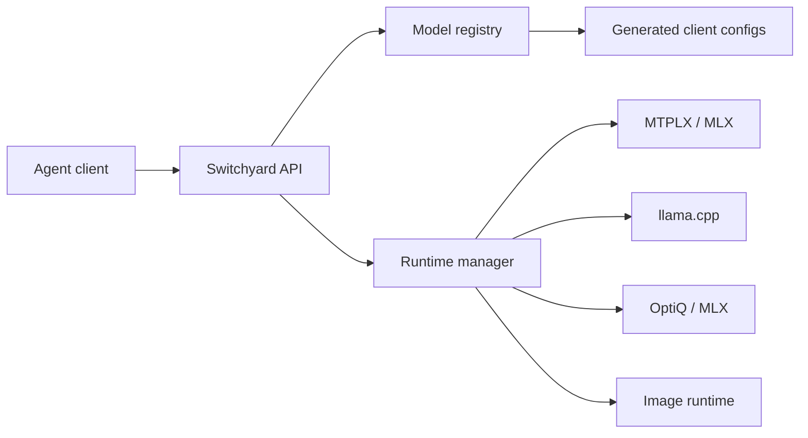

# Switchyard

Switchyard is a local-first LLM gateway for people who run serious open models on their own hardware. It sits in front of MLX, MTPLX, llama.cpp, Ollama, image generators, and other local runtimes, then exposes stable OpenAI-compatible and Anthropic-compatible APIs to agent tools.

The goal is simple: install one bridge, let it pick and keep warm the best model recipe for the machine, and point Codex, Claude Code, OMP, OpenCode, Hermes, Zero, or any OpenAI-compatible client at one base URL.

## Current Shape

- OpenAI-compatible model catalog at `GET /v1/models`
- OpenAI-compatible chat proxy at `POST /v1/chat/completions`
- OpenAI-compatible Responses bridge at `POST /v1/responses`
- OpenAI-compatible image generation proxy at `POST /v1/images/generations`
- Anthropic Messages bridge at `POST /v1/messages`
- Runtime manager for local process start, health checks, stop, warmup, and keep-warm bootstrapping
- Backend catalog for MTPLX, MLX LM, llama.cpp, Ollama, OptiQ, stable-diffusion.cpp, and vLLM
- Community benchmark evidence files that rank model/backend recipes for a machine class
- Generated OMP and OpenCode config from the same model registry the gateway advertises
- Recipe files for machine/model/backend choices, starting with the Apple Silicon Qwen3.6 MTPLX/OptiQ lane

## Quick Start

```zsh
git clone <repo-url> switchyard
cd switchyard
npm run check
SWITCHYARD_CONFIG=config/default.json npm start
```

Default local endpoint:

```zsh
curl -sS http://127.0.0.1:8100/health
curl -sS http://127.0.0.1:8100/v1/models
curl -sS http://127.0.0.1:8100/gateway/status
```

First-run local config:

```zsh
node bin/switchyard.mjs init
node bin/switchyard.mjs init --config-out ~/.switchyard/config.json --model-root ~/.switchyard/models --client omp --apply --yes
SWITCHYARD_CONFIG=~/.switchyard/config.json npm start
```

`init` profiles the machine, selects the best recipe, enables that recipe's runtimes in a user config, points model paths at your model root, sets the keep-warm runtime, and writes generated client profiles. It is a dry-run by default; `--apply --yes` writes the config and generated profiles. Add `--integrate` when you want it to also write native client files such as `~/.omp/agent/models.yml`.

Full backend/model setup plan:

```zsh
node bin/switchyard.mjs bootstrap
node bin/switchyard.mjs bootstrap --apply --yes
```

`bootstrap` profiles the machine, selects the best recipe, plans backend setup, plans model download/tuning, and plans client integration writes. It is a dry-run by default.

Generate client configs:

```zsh
npm run generate:clients
node bin/switchyard.mjs integrations
node bin/switchyard.mjs integrate all
```

Outputs:

- `clients/generated/omp-models.yml`
- `clients/generated/opencode.json`
- `clients/generated/codex.env`
- `clients/generated/claude.env`
- `clients/generated/hermes.env`
- `clients/generated/zero.env`
- `clients/generated/switchyard-integrations.json`

Committed examples live in `clients/examples/`; generated files are ignored so local machine-specific config changes do not become source churn.

The generator reads the gateway registry. If a model ID is stale, remove it from the registry. Switchyard does not hide stale IDs with fallback compatibility aliases.

`integrate` is a dry-run by default. Real client file writes require both `--apply` and `--yes`:

```zsh
node bin/switchyard.mjs integrate omp --apply --yes
```

OMP has a native target at `~/.omp/agent/models.yml`. OpenCode, Codex, Claude-compatible, Hermes, and Zero profiles are written as managed Switchyard artifacts under `~/.switchyard/integrations/` until their stable native config contracts are pinned.

Inspect install recipes:

```zsh
node bin/switchyard.mjs profile
node bin/switchyard.mjs backends
node bin/switchyard.mjs backend-plan mtplx
node bin/switchyard.mjs backend-install mtplx
node bin/switchyard.mjs select
node bin/switchyard.mjs recipes
node bin/switchyard.mjs benchmarks
node bin/switchyard.mjs benchmarks apple-silicon-qwen36
node bin/switchyard.mjs plan apple-silicon-qwen36 --model-root ~/Models
node bin/switchyard.mjs install apple-silicon-qwen36 --model-root ~/Models
```

Recipe selection distinguishes `selectable` from `runnable`: a recipe can be the best match for the machine even if setup still needs to install or expose a backend command. Plans are intentionally explicit: Switchyard reports checks, downloads, tuning commands, model mappings, and platform requirements before executing anything. `install` is a dry-run by default. Real execution requires both `--apply` and `--yes`:

```zsh
node bin/switchyard.mjs install apple-silicon-qwen36 --model-root ~/Models --apply --yes
```

Completed real install steps are recorded in `data/install-state.json`, so interrupted setup can resume without rerunning completed steps.

Runtime management endpoints:

```zsh
curl -sS -X POST http://127.0.0.1:8100/gateway/runtimes/mtplx-qwen36-27b-speed/start
curl -sS -X POST http://127.0.0.1:8100/gateway/runtimes/mtplx-qwen36-27b-speed/warmup
curl -sS -X POST http://127.0.0.1:8100/gateway/runtimes/mtplx-qwen36-27b-speed/stop
```

Requests through chat/image/message APIs call the runtime manager automatically. Manual `start` is allowed for configured runtimes even when `enabled` is false; automatic model-request startup and keep-warm bootstrapping require `enabled: true`.

Backend plans are read-only readiness reports. They show supported platforms, expected commands, server protocol paths, and setup steps for each runtime family. Recipes reference backend IDs from the catalog so community recipes can share a common backend vocabulary.

Backend installs are dry-runs by default. Real execution requires `--apply --yes` and writes resumable state to `data/install-state.json`. Link steps can create local command shims in `data/bin`, so a backend installed beside Switchyard can be exposed without a global install:

```zsh
node bin/switchyard.mjs backend-install mtplx --apply --yes
export PATH="$PWD/data/bin:$PATH"
```

Benchmark evidence lives in `benchmarks/community/*.json`. `switchyard benchmarks` validates and ranks all local evidence, while recipe plans attach the best matching result to each model role.

## Model IDs

The registry is the source of truth. `/v1/models`, OMP YAML, and OpenCode JSON are all derived from `models[]` in `config/default.json`.

Current Apple Silicon headline defaults:

- Fastest dense 27B: `Youssofal/Qwen3.6-27B-MTPLX-Optimized-Speed`
- Fastest 35B-A3B MoE observed here: `Youssofal/Qwen3.6-35B-A3B-MTPLX-Optimized-Speed-FP16`

Durable route aliases such as `qwen36-27b-fastest` are allowed for scripts and humans, but clients should prefer exact advertised IDs when they need a stable catalog.

## Architecture



## Roadmap

- Recipe apply rollback and richer progress UI
- Anthropic streaming parity for tool use and reasoning blocks
- Responses API parity for tools, reasoning blocks, and multimodal output items
- Richer backend installers for MTPLX, MLX, llama.cpp, Ollama, and image/audio runtimes
- Machine profiler and automatic recipe selection
- Community recipe index and signed benchmark submissions
- Per-model memory admission, eviction, and warmup policy
- Vision, image output, speech, and transcription parity across supported backends
